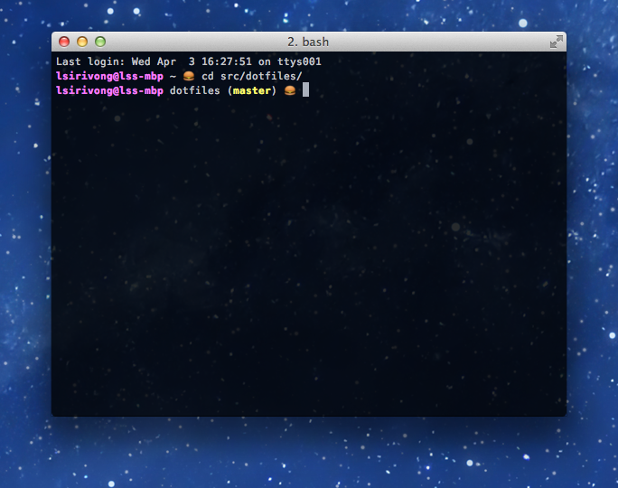

# My dot files
Let me show you them

## Set up
1. Clone
2. `mv ~/.bash_profile ~/.bash_profile_BAK`
3. `mv ~/.bashrc ~/.bashrc_BAK`
4. `ln /path/to/dotfiles/.bash_profile ~/.bash_profile`
5. `ln /path/to/dotfiles/.bashrc ~/.bashrc`
6. restart terminal/iterm or: `source ~/.bash_profile`
